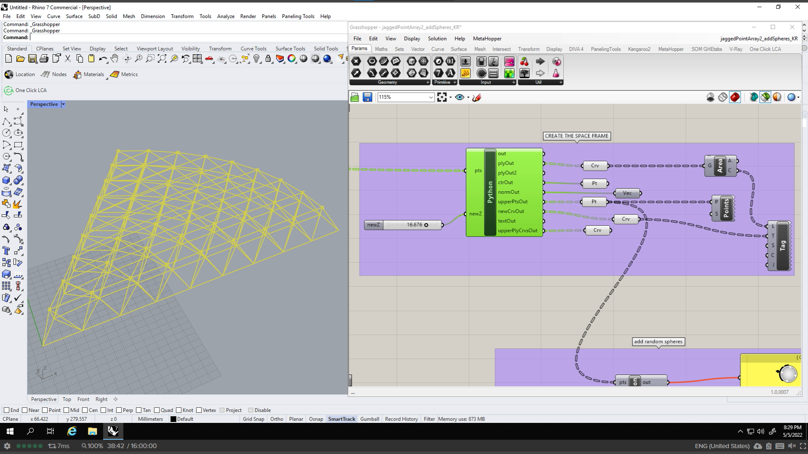

# ghspaceframe

## Programs used: Grasshopper with Rhino7

Rhino7 is a program designers use for 3d modeling and Grasshopper is a plugin that allows designers to use parametrics for computational design. While the following can be achieved using the Grasshopper elements alone, python for Grasshopper is another way for designers to get creative with their design process and methods.

### jaggedPointArray2.py

The space frame is created to take an array of array of points. In python, I created an array of polylines from the points to create triangles. Then, I found the centroid of the triangle to determine the normal by the function findRasedPt(), which allowed me to raise the centroid coordinates along the Z axis. Next, the function findNewCrv() would connect each point of the triangle to the raised centroid point. Finally, I created another for loop that created polylines using the raised centroid points, which becomes the top part of the space frame (shown below).

### createSpheres.py

the centroid points were then input into this python script to create spheres on this layer of the space frame. I created a function that would take points and a radius. This function would return spheres at each point with a random radius. This function would be called in the for loop so that each point returns a sphere.

